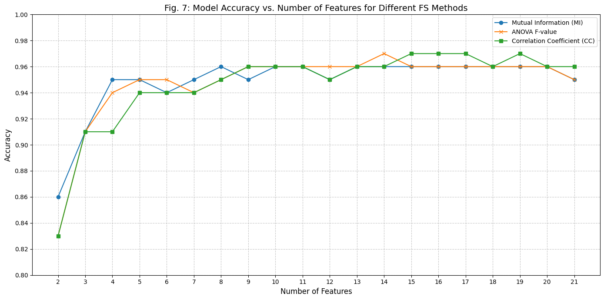
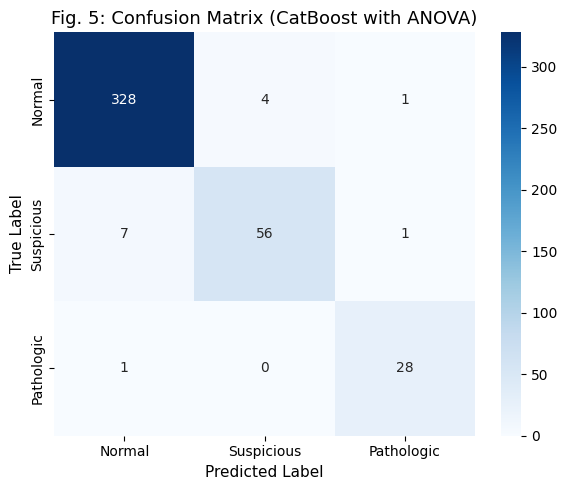

# Fetal Health Classification using CatBoost
This project focuses on building a high-performance machine learning model for fetal health classification, with emphasis on feature selection and model evaluation.

## Overview
This type of model can assist healthcare professionals in early detection of fetal health risks.

## Key Features
- Built using CatBoost for efficient classification
- Achieved ~97% accuracy with optimized feature set
- Applied feature selection techniques to improve model performance
- Evaluated model using standard classification metrics

## Dataset
CTG (Cardiotocography) dataset used for fetal health classification.

## Workflow
1. Data preprocessing and cleaning  
2. Feature selection (ANOVA, Mutual Information, Correlation)  
3. Model training using CatBoost  
4. Model evaluation using performance metrics  

## Results
**Accuracy: ~97%**

Model performance evaluated using precision, recall, F1-score, and confusion matrix.
 
## Model Comparison
- CatBoost: ~97%
- Random Forest: ~93%
- SVM: ~90%
- 
## Sample Output

### Accuracy / Performance

### Confusion Matrix

## Tech Stack
Python, Pandas, NumPy, scikit-learn, CatBoost, Matplotlib

## How to Run
pip install -r requirements.txt  
Run the notebook

## Contribution
- Developed and trained machine learning model using CatBoost  
- Applied feature selection techniques to optimize performance  
- Evaluated model performance and generated results  
